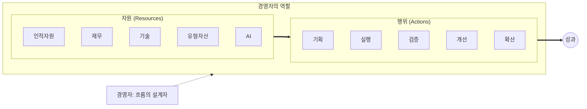

# AI 시대, 경영자의 새로운 무기
## 클로드 코드로 체험하는 차세대 매니지먼트

---

# 목차

1. [경영자의 본질: 흐름의 아키텍트](#1-경영자의-본질)
2. [자원 믹스의 대전환](#2-자원-믹스의-대전환)
3. [Focus: 변하지 않는 최대의 무기](#3-focus-변하지-않는-최대의-무기)
4. [제2의 뇌: AI를 정보 흐름에 연동하기](#4-제2의-뇌)
5. [클로드 코드: 무한한 AI의 힘을 체험하다](#5-클로드-코드-체험)
6. [지시, 위임, 검증, 공유의 새로운 방식](#6-새로운-방식)
7. [10배수의 효율로 접근하기](#7-10배수-효율)
8. [실전: 클로드 코드 시작하기](#8-실전-시작)
9. [맥락 전달의 기술](#9-맥락-전달)
10. [다음 시대의 매니지먼트를 향하여](#10-다음-시대)

---

# 1. 경영자의 본질: 흐름의 아키텍트 {#1-경영자의-본질}

## 1.1 경영자란 누구인가

경영자는 **흐름의 아키텍트**입니다.

사내의 자원과 행위(action, execution)의 흐름을 정리하고 설계하여,
더 많은 성과로 이끌어가는 사람입니다.



### 비유: 오케스트라 지휘자

```
악기 연주자 = 직원들
악보 = 전략과 프로세스
지휘자 = 경영자

지휘자는 악기를 직접 연주하지 않습니다.
하지만 언제 누가 어떻게 연주할지를 설계하고,
전체가 하나의 아름다운 음악이 되도록 이끕니다.

좋은 지휘자가 없으면?
아무리 뛰어난 연주자들이 모여도 불협화음이 됩니다.
```

## 1.2 지금까지 가장 큰 임팩트를 미친 것

경영의 핵심 자원은 언제나 **인적 자원**이었습니다.

**경영자의 시간 분배 (전통적)**

| 활동                | 비중 | 세부 항목                                                |
| ------------------- | ---- | -------------------------------------------------------- |
| 인사 관련 활동      | 60%  | 채용과 평가, 육성과 성장, 동기부여와 인센티브, 문화 형성 |
| 전략 수립           | 20%  | -                                                        |
| 재무/기술/자산 관리 | 15%  | -                                                        |
| 기타                | 5%   | -                                                        |

그러나 더 깊이 들어가면, 인적 자원 중에서도 가장 큰 임팩트를 미친 것은
**사람들의 머릿속**에서 이뤄진 것들입니다:

| 요소              | 설명                        | 임팩트                |
| ----------------- | --------------------------- | --------------------- |
| **방향성**        | 어디로 가야 하는지 아는 것  | 모든 노력의 방향 결정 |
| **숙달도**        | 업무를 얼마나 잘 수행하는가 | 실행의 품질 결정      |
| **개념**          | 업무를 어떻게 이해하는가    | 판단의 기준 결정      |
| **인센티브 구조** | 무엇이 동기를 부여하는가    | 행동의 방향 결정      |
| **문화**          | 집단이 공유하는 가치와 방식 | 위 모든 것의 토양     |

### 핵심 통찰

> **"경영자의 가장 큰 지렛대는 사람들의 머릿속에 무엇이 들어있는가"**입니다.
>
> 전략 문서가 아무리 훌륭해도,
> 그것이 사람들의 머릿속에서 살아 움직이지 않으면 의미가 없습니다.

---

# 2. 자원 믹스의 대전환 {#2-자원-믹스의-대전환}

## 2.1 새로운 레버리지의 등장

경영자의 자원 포트폴리오에 새로운 요소가 추가되었습니다.

```
자원 믹스의 변화

[과거]                          [현재/미래]

인적자원 ████████████            인적자원 ████████████
재무    ████████                재무    ████████
기술    ██████                  기술    ██████
유형자산 ████                    유형자산 ████
                                AI     ████████████  ← NEW!
```

### AI가 가져온 새로운 가능성

| 영역            | 과거                          | AI 시대                     |
| --------------- | ----------------------------- | --------------------------- |
| **지식의 정리** | 문서화 → 공유 → 학습 (수개월) | 즉시 구조화 → 즉시 활용     |
| **지식의 전달** | 교육 → 멘토링 → 체득 (수년)   | AI가 맥락 파악 → 즉시 안내  |
| **실행의 속도** | 기획 → 개발 → 검증 (수주)     | 지시 → 생성 → 검증 (수시간) |
| **규모의 확장** | 인력 충원 필요                | AI 에이전트 확장            |

## 2.2 불변하는 것과 변하는 것

### 불변: 경영자의 본질적 역할

```
경영자 = 자원을 활용해서
        단기, 중기, 장기적 성과를 극대화하는
        전문가이자 리더

이것은 변하지 않습니다.
```

### 변화: 믹스의 비율과 활용 방식

| 구분      | 2020년 (인적자원 중심) | 2025년~ (AI 레버리지)    |
| --------- | ---------------------- | ------------------------ |
| 핵심 역량 | 좋은 사람 채용이 핵심  | 좋은 사람 + AI 활용 능력 |
| 육성      | 육성에 수년 투자       | AI가 학습 가속화         |
| 지식 축적 | 지식은 사람에게 축적   | 지식은 시스템에 축적     |
| 실행      | 실행도 사람이 직접     | AI가 실행을 가속화       |

> 인적자원의 가치가 줄어든 게 아닙니다.
> **AI를 활용하는 인적자원의 가치가 폭발적으로 늘어난 것입니다.**

## 2.3 비유: 농업혁명

```
손으로 밭 가는 시대
→ 경험 많은 농부가 핵심 자원
→ 한 사람이 1헥타르 관리

트랙터 등장
→ 트랙터 운전 능력이 새로운 핵심 역량
→ 한 사람이 100헥타르 관리 가능

경험 많은 농부의 가치가 사라진 게 아닙니다.
"트랙터를 잘 다루는 경험 많은 농부"의 가치가 100배가 된 것입니다.

AI도 마찬가지입니다.
"AI를 잘 다루는 훌륭한 직원"의 가치가 폭발하고 있습니다.
```

---

# 3. Focus: 변하지 않는 최대의 무기 {#3-focus-변하지-않는-최대의-무기}

## 3.1 모든 것은 결국 Focus 문제

사람이든 AI든, 성과를 좌우하는 가장 큰 요소는 **집중**입니다.

| 구분 | 사람 | AI | 사람+AI |
| :--- | :--- | :--- | :--- |
| **한계** | 집중력 한계 있음 | Context 한계 있음 | 두 한계 존재 |
| **맥락 증가 시** | 혼란 발생 | 혼란 발생 | 더 복잡한 혼란 |
| **결과** | 효율성 급락 | 효율성 급락 | 효율성 급락 |
| **부채** | 경영적 채무 | 기술적 채무 | 복합 채무 |

## 3.2 리더가 필요한 이유

### 사람의 경우

```
정보가 폭발하는 조직에서...

직원 A: "이것도 해야 하고, 저것도 해야 하고,
        우선순위가 뭔지 모르겠어요..."

리더의 역할:
"지금 가장 중요한 건 이거야. 나머지는 다음 분기에 하자."
→ 물 흐르듯 안내
→ 효율성 회복
```

### AI의 경우

```
맥락이 폭발하는 대화에서...

AI: "사용자가 A도 말했고, B도 말했고, C도 말했는데,
     무엇을 우선해야 할지 판단이 어렵습니다..."

효과적인 지시:
"지금은 A에만 집중해. B와 C는 잊어도 돼."
→ 명확한 범위 설정
→ 효율성 회복
```

### 사람 + AI의 경우

```
복합적인 업무 환경에서...

문제: "AI 출력을 검토하는 사람도 맥락에 압도됨"

해결:
1. AI에게 명확한 범위만 지시
2. 출력을 구조화된 형태로 요청
3. 사람은 핵심만 검증
→ 양쪽의 Focus 최적화
```

## 3.3 경영자의 새로운 과제

> **"너무 많은 맥락을 어떻게 단순화시켜 효율성을 확보하고,
> 그 무기를 극대화할 것인가?"**

### 비유: 강물의 흐름

```
[혼란스러운 상태]
                  ~~~
            ~~~~~~~~~~~
       ~~~~~~~~~~~~~~~~
    ~~~~~~~~~~~~~~~~~~~  ← 물이 사방으로 흩어짐
       ~~~~~~~~~~~~~~~~     (에너지 분산)
            ~~~~~~~~~~~
                  ~~~

[Focus가 작동하는 상태]
       ┃
       ┃
       ┃    ← 한 방향으로 집중
       ┃       (에너지 증폭)
       ┃
       ▼
       💥 강력한 임팩트
```

물이 사방으로 퍼지면 힘이 약해지지만,
한 방향으로 모으면 바위도 뚫습니다.

**경영자의 역할은 조직의 에너지를 모아주는 것입니다.**
**AI 시대에는 AI의 에너지도 함께 모아야 합니다.**

---

# 4. 제2의 뇌: AI를 정보 흐름에 연동하기 {#4-제2의-뇌}

## 4.1 세 가지 핵심 질문

AI 시대 경영자가 답해야 할 세 가지 질문:

```
┌─────────────────────────────────────────────────────────┐
│                      핵심 질문                           │
├─────────────────────────────────────────────────────────┤
│                                                         │
│  1️⃣ 정보의 흐름 위에 제2의 뇌(AI)를                        │
│     어떻게 연동할 수 있는가?                              │
│                                                         │
│  2️⃣ 사람들은 그 위에서                                   │
│     어떻게 더 집중하고 더 효율을 낼 수 있는가?              │
│                                                         │
│  3️⃣ 우리 사업 고유의 기회와 약점에                        │
│     10배수의 효율로 접근할 기회는 어디에 있는가?            │
│                                                         │
└─────────────────────────────────────────────────────────┘
```

## 4.2 제2의 뇌란

### 비유: 뇌의 확장

| 항목       | 인간의 뇌             | AI라는 제2의 뇌         |
| ---------- | --------------------- | ----------------------- |
| 기억/저장  | 단기 기억 제한적      | 저장 용량 사실상 무제한 |
| 검색/회상  | 장기 기억 검색 어려움 | 검색 즉각적             |
| 처리 속도  | 느림                  | 초고속                  |
| 멀티태스킹 | 비효율적              | 효율적                  |
| **장점**   | 창의성, 판단력, 공감  | 반복, 정리, 분석, 실행  |

**연동된 상태 (인간의 뇌 ↔ AI의 뇌):**
- 창의성 + 속도
- 판단력 + 규모
- 공감 + 정확성

## 4.3 정보 흐름에 AI 연동하기

### 전통적 정보 흐름

```
정보 발생
    ↓
문서화 (수작업)
    ↓
공유 (이메일, 회의)
    ↓
학습 (각자 읽음)
    ↓
활용 (기억에 의존)

⏱️ 정보가 활용되기까지: 수일~수주
❌ 손실: 50% 이상 (망각, 오해, 누락)
```

### AI 연동 정보 흐름

```
정보 발생
    ↓
AI가 즉시 구조화 ← 클로드 코드가 정리
    ↓
AI가 맥락 파악 ← 관련 정보와 연결
    ↓
필요할 때 AI에 질문 ← 즉시 답변
    ↓
AI가 실행까지 지원 ← 코드, 문서, 분석 자동화

⏱️ 정보가 활용되기까지: 수분
✅ 손실: 최소화 (기록, 검색, 재활용)
```

## 4.4 사람들이 더 집중할 수 있게

### 역할 분담

| 🤖 AI에게 위임       | 🧠 사람이 집중   |
| -------------------- | ---------------- |
| 반복적인 정리 작업   | 전략적 판단      |
| 패턴이 있는 분석     | 창의적 아이디어  |
| 초안 작성            | 이해관계자 설득  |
| 데이터 수집 및 가공  | 예외 상황 대응   |
| 일정한 형식의 보고서 | 가치관 기반 결정 |

### 비유: 전투기 조종사

```
과거의 전투기:
조종사가 모든 계기 직접 확인
→ 인지 부하 극심
→ 놓치는 정보 많음

현대의 전투기:
AI가 수백 개 센서 모니터링
AI가 이상 신호만 조종사에게 알림
조종사는 판단과 결정에 집중
→ 인지 부하 감소
→ 더 나은 판단 가능
```

---

# 5. 클로드 코드: 무한한 AI의 힘을 체험하다 {#5-클로드-코드-체험}

## 5.1 왜 클로드 코드인가

경영자에게 다소 어려운 도구로 느껴질 수 있습니다.
그러나 **클로드 코드만큼 AI의 잠재력을 직접 체험할 수 있는 도구는 없습니다.**

```
┌─────────────────────────────────────────────────────────┐
│               AI 도구 스펙트럼                           │
├─────────────────────────────────────────────────────────┤
│                                                         │
│  쉬움 ←─────────────────────────────────────→ 강력함    │
│                                                         │
│  ChatGPT      Notion AI      Cursor      Claude Code   │
│  (대화만)      (문서 보조)    (코딩 보조)   (실제 실행)   │
│                                                         │
│  "대화해요"   "문서 써줘"   "코드 써줘"   "직접 해줘"    │
│                                                         │
│  📱           📝            💻           🚀             │
│                                                         │
└─────────────────────────────────────────────────────────┘

클로드 코드는 가장 오른쪽에 있습니다.
실제로 파일을 읽고, 쓰고, 명령을 실행합니다.
"이론"이 아니라 "실제"를 보여줍니다.
```

## 5.2 클로드 코드가 보여주는 것

클로드 코드를 통해 체험할 수 있는 것:

### 1. 업무 지시의 새로운 방식

```
과거: "김 대리, 매출 보고서 정리해주세요"
      → 김 대리의 해석
      → 김 대리의 역량에 의존
      → 며칠 후 결과물

클로드 코드: "매출 데이터를 분석해서 보고서 만들어줘"
             → AI가 즉시 해석
             → 명확한 질문으로 확인
             → 몇 분 후 결과물
             → 마음에 안 들면 즉시 수정 요청
```

### 2. 맥락의 완벽한 전달

```
과거:
신입사원: "이 프로젝트 맥락이 뭐예요?"
선임: "음... 작년에 A가 있었고, B 때문에 C로 결정했고..."
     (30분 설명, 그래도 50% 이해)

클로드 코드:
AI에게: "이 프로젝트 폴더의 모든 문서를 읽고 맥락을 정리해줘"
AI: (모든 파일 분석 후)
    "이 프로젝트는... 핵심 결정사항은... 현재 이슈는..."
    (5분, 90% 이해)
```

### 3. 즉각적인 실행

```
과거:
"이 데이터 분석해서 차트로 만들어줘"
→ 담당자 배정
→ 도구 선택
→ 작업 수행
→ 검토 요청
→ 수정
⏱️ 2-3일

클로드 코드:
"이 CSV 파일 분석해서 matplotlib로 차트 그려줘"
→ 코드 생성
→ 실행
→ 결과 확인
→ "막대 색상 파란색으로 바꿔줘"
→ 수정 완료
⏱️ 5분
```

## 5.3 체험의 가치

> **"이 부분들을 매니저들이 피부로 느껴야만,
> 다음 시대의 매니지먼트에 대한 감이 잡히기 시작합니다."**

```
┌─────────────────────────────────────────────────────────┐
│                   체험 전 vs 체험 후                      │
├─────────────────────────────────────────────────────────┤
│                                                         │
│  [체험 전]                                              │
│  "AI가 좋다던데... 우리 회사에 어떻게 적용하지?"           │
│  "개발팀한테 시키면 되지 않나?"                          │
│  "나는 기술을 몰라도 되지 않나?"                         │
│                                                         │
│  [체험 후]                                              │
│  "아, 이런 식으로 지시하면 이런 결과가 나오는구나"         │
│  "맥락을 이렇게 전달하면 AI도 이해하는구나"               │
│  "우리 업무 중 이건 AI가 할 수 있겠는데?"                │
│  "팀원들에게 이런 방식으로 AI 활용을 안내해야겠다"        │
│                                                         │
└─────────────────────────────────────────────────────────┘
```

---

# 6. 지시와 정렬(Alignment): 사람에게도, AI에게도 통하는 원칙 {#6-새로운-방식}

> **"모호한 지시는 사람에게도 혼란이고, AI에게도 혼란입니다."**

이 장은 이 가이드의 핵심입니다.
경영에서 가장 중요한 것이 무엇인지 생각해보세요.

**지시와 지침, 그리고 그에 필요한 정보의 전달, 최종 목표의 공유.**

이것이 조직을 움직이는 근본입니다.

---

## 6.1 신입사원에게 지시할 때 생기는 일

### 상황: 신입사원 김 대리에게 보고서를 요청했습니다

```
[사장]
"김 대리, 매출 보고서 좀 만들어주세요."

[김 대리의 머릿속]
"매출 보고서...?
 어떤 기간이지? 이번 달? 분기? 연간?
 어떤 형식으로? PPT? 엑셀? 워드?
 얼마나 상세하게? 제품별? 지역별?
 언제까지? 오늘? 이번 주?
 누구한테 보여주는 거지? 팀장님? 임원?

 ...일단 해보고 물어봐야겠다."
```

### 2주 후 결과

```
[사장]
"이게 뭐야? 내가 원한 건 이게 아닌데..."

[김 대리]
"네? 매출 보고서 만들어달라고 하셨잖아요.
 월별로 정리했는데요..."

[사장]
"아니, 나는 3분기 실적을 경영진 미팅에
 보여줄 5페이지짜리 요약본을 원했던 거야!"

[김 대리]
"그런 말씀 안 하셨는데요..."

→ 2주 낭비
→ 다시 작업
→ 서로 좌절
```

### 이것은 김 대리 잘못이 아닙니다

```
┌─────────────────────────────────────────────────────────┐
│           모호한 지시가 만드는 혼란의 구조                  │
├─────────────────────────────────────────────────────────┤
│                                                         │
│   사장의 머릿속     →    말로 전달    →   김 대리의 해석   │
│                                                         │
│   ┌─────────────┐     ┌─────────┐     ┌─────────────┐   │
│   │ 3분기 실적   │     │ 매출    │     │ 뭔가 매출   │   │
│   │ 경영진 미팅용 │     │ 보고서  │     │ 관련된 것   │   │
│   │ 5페이지 요약 │     │ 만들어  │     │ 만들면 되나? │   │
│   │ 전년 대비    │     │         │     │             │   │
│   │ 핵심만      │     │         │     │             │   │
│   └─────────────┘     └─────────┘     └─────────────┘   │
│                                                         │
│        100%              20%              ???           │
│                                                         │
│   ❌ 전달 과정에서 80%의 맥락이 손실됨                     │
│                                                         │
└─────────────────────────────────────────────────────────┘
```

---

## 6.2 AI에게 지시할 때도 똑같습니다

### 같은 상황을 AI에게 적용하면

```
[사용자]
"매출 보고서 만들어줘"

[AI의 반응]
"매출 보고서를 만들어드리겠습니다.

 몇 가지 확인이 필요합니다:
 - 어떤 기간의 데이터인가요?
 - 데이터 파일이 있나요?
 - 어떤 형식을 원하시나요?
 - 주요 분석 포인트가 있나요?"
```

AI는 최소한 **질문을 합니다.**
하지만 사람은 종종 **"알아서 하겠지"** 하고 질문 없이 진행합니다.

### 핵심 통찰

> **AI에게 명확하게 지시하는 법을 배우면,
> 사람에게도 명확하게 지시하게 됩니다.**

```
┌─────────────────────────────────────────────────────────┐
│                지시의 보편적 원칙                         │
├─────────────────────────────────────────────────────────┤
│                                                         │
│   신입사원          ≈          AI                       │
│                                                         │
│   - 맥락을 모름              - 맥락을 모름              │
│   - 암묵적 기대를 모름        - 암묵적 기대를 모름        │
│   - 조직 문화를 모름          - 조직 문화를 모름          │
│   - 과거 히스토리를 모름      - 과거 히스토리를 모름      │
│                                                         │
│   → 명확한 지시가 필요!       → 명확한 지시가 필요!       │
│                                                         │
└─────────────────────────────────────────────────────────┘
```

---

## 6.3 "회식에서 다 알려줬잖아" 문제

### 암묵적 상식에 의존하는 조직

많은 조직에서 중요한 정보가 전달되는 곳:

```
📍 회식 자리
   "우리 회사는 원래 이렇게 해"
   "사장님이 이런 스타일 좋아하셔"

📍 담배 피우면서
   "저 프로젝트 조심해, 예전에 문제 있었거든"

📍 점심 식사하면서
   "그 고객은 까다로워, 항상 3번은 수정해야 해"

📍 복도에서 스쳐가면서
   "참, 그거 급하대"
```

### 문제점

```
┌─────────────────────────────────────────────────────────┐
│           암묵적 지식 전달의 한계                         │
├─────────────────────────────────────────────────────────┤
│                                                         │
│  1. 일관성 부족                                         │
│     → 사람마다 다르게 이해                               │
│     → "나는 그렇게 들었는데?"                            │
│                                                         │
│  2. 전파 속도 느림                                      │
│     → 신입이 "알게 될 때까지" 수개월                     │
│     → 그동안 실수 반복                                  │
│                                                         │
│  3. 기록이 없음                                         │
│     → 핵심 인력 퇴사 시 지식 유실                        │
│     → "그건 박 팀장이 알았는데, 퇴사했어..."              │
│                                                         │
│  4. 확장 불가능                                         │
│     → 조직이 커질수록 정보 전달 병목                     │
│     → 사일로 현상 심화                                  │
│                                                         │
└─────────────────────────────────────────────────────────┘
```

### 이것이 "정렬(Alignment)" 문제입니다

```
                    목표
                     ↑
                     │
    ┌────────────────┼────────────────┐
    │                │                │
    A 직원           B 직원           C 직원
    (이해: 70%)      (이해: 50%)      (이해: 90%)

    → 방향이 제각각
    → 에너지 분산
    → 성과 저하
```

---

## 6.4 클로드 코드가 보여주는 해법: Documentation의 힘

### 전통적 문서화 vs AI 시대 문서화

```
[전통적 문서화]
작성 → 저장 → 망각 → 검색 안 됨 → 무용지물

"어디 저장했더라?"
"최신 버전이 뭐지?"
"이거 읽을 시간이 어딨어"

[AI 시대 문서화 - 클로드 코드]
작성 → AI가 읽음 → AI가 기억 → 질문하면 답변 → 살아있는 지식

"이 프로젝트 맥락이 뭐야?" → AI가 즉시 설명
"우리 회사 스타일로 보고서 써줘" → AI가 스타일 반영
"예전에 이런 문제 어떻게 해결했어?" → AI가 히스토리 참조
```

### CLAUDE.md: 기하급수적으로 강력해지는 정렬

클로드 코드에서 `/memory` 명령으로 만드는 CLAUDE.md 파일은
**AI에게 주는 "회사 안내서"**입니다.

```markdown
# CLAUDE.md - 우리 회사 AI 가이드

## 회사 정보
- 회사명: ABC 테크
- 업종: B2B SaaS
- 핵심 가치: "고객 성공이 우리 성공"

## 우리의 일하는 방식
- 보고서는 항상 "결론 먼저"
- 숫자는 반드시 출처 명시
- 고객 이름은 코드명으로 (고객A, 고객B)
- 내부 공유는 Notion, 외부 공유는 PDF

## 자주 하는 실수 (하지 마세요)
- 가격 정보 외부 공유 ❌
- 경쟁사 직접 언급 ❌
- 예상 일정 확정적으로 말하기 ❌

## 보고서 스타일
- 서론: 1페이지 이내
- 핵심 내용: 3-5페이지
- 결론: 1페이지
- 폰트: 맑은 고딕, 11pt

## 주요 용어
- "딜": 영업 기회
- "파이프라인": 진행 중인 딜 목록
- "클로징": 계약 체결
```

### 이 문서가 있으면

```
[문서 없이 AI에게 요청]
"보고서 써줘"
→ AI: 일반적인 형식으로 작성
→ 우리 회사 스타일과 안 맞음
→ 수정 필요

[문서 있이 AI에게 요청]
"보고서 써줘"
→ AI: CLAUDE.md 참조
→ "결론 먼저" 스타일 적용
→ 고객명 코드명으로 자동 변환
→ 우리 회사 스타일과 일치
→ 바로 사용 가능!
```

---

## 6.5 사람에게도 같은 원리가 적용됩니다

### Documentation = 모든 구성원이 공유하는 기준점

```
[문서화 전]

사장 → 팀장A에게 설명 (버전 1.0)
      → 팀장B에게 설명 (버전 1.1, 약간 다름)

팀장A → 팀원1에게 설명 (버전 1.0의 해석)
      → 팀원2에게 설명 (버전 1.0의 다른 해석)

결과: 5명이 5가지 다른 이해를 가짐

[문서화 후]

┌──────────────────┐
│   공식 문서      │ ← Single Source of Truth
│   (회사 위키)    │
└────────┬─────────┘
         │
    ┌────┴────┬────────┬────────┐
    ↓         ↓        ↓        ↓
  사장      팀장A    팀장B    신입

결과: 모두가 같은 기준점을 가짐
```

### 클로드 코드에서 배우는 것

클로드 코드를 사용하면서 자연스럽게 배우게 됩니다:

```
┌─────────────────────────────────────────────────────────┐
│          클로드 코드가 가르쳐주는 것                       │
├─────────────────────────────────────────────────────────┤
│                                                         │
│  1. 명확한 지시의 중요성                                 │
│     "매출 보고서" ❌ → "3분기 매출 요약 5페이지" ✅       │
│                                                         │
│  2. 맥락 문서화의 가치                                   │
│     CLAUDE.md에 적어두면 매번 설명 안 해도 됨             │
│                                                         │
│  3. 구조화된 정보 전달                                   │
│     두서없이 말하기 ❌ → 항목별로 정리 ✅                 │
│                                                         │
│  4. 피드백의 즉각성                                     │
│     AI 결과물 보고 바로 수정 요청 → 빠른 개선 사이클      │
│                                                         │
│  5. 기록의 재활용                                       │
│     좋은 지시 패턴을 저장 → 다음에 재사용                 │
│                                                         │
└─────────────────────────────────────────────────────────┘

이것을 조직 전체에 적용하면?
→ 모든 구성원이 같은 방식으로 소통
→ 신입도 빠르게 정렬
→ AI도 우리 방식대로 일함
→ 기하급수적 효율 향상!
```

---

## 6.6 좋은 지시 vs 나쁜 지시: 실전 비교

### 사례 1: 보고서 요청

```
❌ 나쁜 지시 (사람에게도, AI에게도)
━━━━━━━━━━━━━━━━━━━━━━━━━━━━━━
"매출 보고서 만들어주세요."

결과:
- 신입사원: 어떤 형식? 어떤 기간? → 막막함
- AI: 일반적인 템플릿 → 맞지 않음


✅ 좋은 지시 (사람에게도, AI에게도)
━━━━━━━━━━━━━━━━━━━━━━━━━━━━━━
"다음 주 월요일 경영진 미팅에 쓸
 3분기 매출 보고서를 만들어주세요.

 포함할 내용:
 - 월별 매출 추이 (그래프)
 - 전년 동기 대비 성장률
 - 상위 5개 제품 분석
 - 4분기 전망

 형식: PPT 5페이지 이내
 참고자료: @sales_data/ 폴더

 주의: 고객사명은 코드명으로"

결과:
- 신입사원: 명확한 가이드 → 바로 시작 가능
- AI: 구체적 지시 → 정확한 결과물
```

### 사례 2: 문제 해결 요청

```
❌ 나쁜 지시
━━━━━━━━━━━━
"이거 안 되는데, 좀 봐줘."

결과:
- 신입사원: 뭐가 안 되는 건지? → 우왕좌왕
- AI: 어떤 문제? 어떤 맥락? → 일반적 답변


✅ 좋은 지시
━━━━━━━━━━━━
"로그인 기능에서 문제가 있어요.

 현상:
 - 이메일/비밀번호 입력 후 로그인 버튼 클릭
 - 화면이 멈추고 아무 반응 없음

 환경:
 - Chrome 브라우저
 - 오늘 오전부터 발생
 - 다른 브라우저는 정상

 시도한 것:
 - 캐시 삭제 → 해결 안 됨
 - 다른 계정 시도 → 같은 현상

 관련 파일: @src/login.js"

결과:
- 신입사원: 문제 파악 가능 → 조사 시작
- AI: 맥락 이해 → 구체적 해결책 제시
```

### 사례 3: 새 기능 개발 요청

```
❌ 나쁜 지시
━━━━━━━━━━━━
"대시보드 하나 만들어줘."

→ 신입: "어떤 대시보드요...?" (물어보기 민망)
→ AI: 일반적인 대시보드 생성 (원하는 게 아님)


✅ 좋은 지시
━━━━━━━━━━━━
"영업팀을 위한 실시간 대시보드가 필요해요.

 목적:
 - 매일 아침 팀미팅에서 5분 리뷰용
 - 팀장이 한눈에 현황 파악

 필요한 정보:
 - 이번 달 매출 목표 대비 달성률 (게이지)
 - 진행 중인 딜 Top 5 (표)
 - 팀원별 활동량 (막대그래프)

 데이터 소스:
 - Salesforce API (계정 정보 @config/sf_api.json)

 기술 스택:
 - 우리 회사는 React + TypeScript 사용
 - 차트는 Recharts 라이브러리

 우선순위:
 - 1순위: 목표 달성률
 - 2순위: Top 5 딜
 - 3순위: 활동량 (시간 되면)"

→ 신입: 명확한 스펙 → 바로 개발 가능
→ AI: 상세 지시 → 원하는 결과물
```

---

## 6.7 정렬(Alignment)을 기하급수적으로 강화하는 법

### 클로드 코드의 문서화 체계

```
프로젝트 폴더 구조

my-project/
├── CLAUDE.md          ← AI가 읽는 프로젝트 맥락
├── docs/
│   ├── guidelines.md  ← 우리 회사 가이드라인
│   ├── glossary.md    ← 용어 사전
│   └── decisions.md   ← 주요 결정사항 히스토리
├── templates/
│   ├── report.md      ← 보고서 템플릿
│   └── proposal.md    ← 제안서 템플릿
└── src/
    └── ...
```

### 이 구조가 만드는 마법

```
┌─────────────────────────────────────────────────────────┐
│             문서화가 만드는 승수 효과                      │
├─────────────────────────────────────────────────────────┤
│                                                         │
│   [문서화 없이]                                          │
│   매번 설명 (1시간) × 팀원 10명 × 주 1회 = 40시간/월      │
│                                                         │
│   [문서화 있을 때]                                       │
│   문서 작성 (2시간) + 읽기 (10분 × 10명) = 3.5시간        │
│   AI 활용 시 추가 설명 불필요                             │
│                                                         │
│   절감: 36.5시간/월                                      │
│   1년: 438시간 = 약 55일치 근무시간!                      │
│                                                         │
│   + 일관성 확보                                          │
│   + 신입 온보딩 가속화                                   │
│   + AI 활용도 상승                                       │
│   + 지식 유실 방지                                       │
│                                                         │
└─────────────────────────────────────────────────────────┘
```

### 핵심: 한 번 정리하면 무한히 활용

```
경영자가 CLAUDE.md에 작성:
"우리 보고서는 항상 결론부터 시작한다"

→ 1년 동안 AI가 100개 보고서 생성
→ 100개 모두 "결론 먼저" 스타일
→ 100번 설명할 필요 없음

경영자가 guidelines.md에 작성:
"고객 미팅 후 24시간 내 회의록 공유"

→ 모든 팀원이 참조
→ AI가 회의록 템플릿 자동 생성
→ 24시간 내 알림 자동화 가능
```

---

## 6.8 업무 지시의 진화 요약

### 사람에게 지시할 때

```
좋은 지시의 요소:
1. 명확한 목표
2. 필요한 배경 정보
3. 기대하는 결과물
4. 제약 조건
5. 마감 기한

"김 대리, 다음 주 화요일까지
 3분기 매출 보고서 초안을 만들어주세요.
 작년 동기 대비 분석을 포함하고,
 경영진 미팅에 쓸 거라 5페이지 이내로 요약해주세요."
```

### AI에게 지시할 때

```
좋은 프롬프트의 요소:
1. 명확한 목표 (동일)
2. 필요한 맥락 (더 구체적으로)
3. 원하는 형식 (더 정확하게)
4. 제약 조건 (더 명시적으로)
5. 확인 방법 (체크리스트)

"3분기 매출 데이터 파일 @sales_q3.csv를 분석해서
 작년 동기 대비 성장률을 계산하고,
 상위 5개 제품의 성과를 막대 그래프로 시각화해줘.

 포함할 내용:
 - 월별 매출 추이
 - 전년 대비 증감률
 - 주요 인사이트 3가지

 형식: 파이썬 코드로 생성하고, 결과는 PNG로 저장
 제외: 개인정보, 원가 정보"
```

### 공통점과 차이점

| 요소        | 사람에게       | AI에게               |
| ----------- | -------------- | -------------------- |
| 명확한 목표 | 필수           | 필수                 |
| 배경 설명   | 상황에 따라    | 항상 명시            |
| 암묵적 기대 | 경험으로 유추  | 명시해야 함          |
| 질문 가능성 | 스스로 질문    | 질문하도록 유도 필요 |
| 수정 요청   | 시간/비용 발생 | 즉시 가능            |

## 6.2 위임의 진화

### 전통적 위임 모델

```
경영자
    ↓ 위임
중간 관리자
    ↓ 재위임
실무자
    ↓ 수행
결과물

⏱️ 전달 시간: 수일
❌ 맥락 손실: 각 단계마다 발생
🔄 수정 사이클: 느림
```

### AI 레버리지 위임 모델

```
경영자
    ↓ 위임
중간 관리자 + AI
    ↓
┌───────────────┐
│ AI가 초안 생성 │ ← 빠른 실행
│ 관리자가 검토  │ ← 판단력 적용
│ AI가 수정     │ ← 빠른 반영
└───────────────┘
    ↓
결과물 → 경영자 승인

⏱️ 전달 시간: 수시간
✅ 맥락 손실: 최소화 (AI가 기록 유지)
🔄 수정 사이클: 즉각적
```

### 비유: 비서와 AI 비서

```
전통적 비서:
사장 → "다음 주 일정 잡아줘"
비서 → (여러 사람에게 연락, 조율)
비서 → "화요일 2시 어떠세요?"
사장 → "목요일은?"
비서 → (다시 연락, 조율)
⏱️ 1-2일

AI 비서 (미래):
사장 → "다음 주 일정 잡아줘"
AI → (캘린더 분석, 참석자 일정 확인)
AI → "화요일 2시, 목요일 4시, 금요일 10시 가능합니다"
사장 → "목요일로"
AI → (즉시 초대 발송)
⏱️ 5분
```

## 6.3 검증의 진화

### 왜 검증이 더 중요해졌는가

```
과거:
사람이 한 일 → 사람이 검증
(속도: 느림, 양: 적음, 검증 가능)

AI 시대:
AI가 한 일 → 사람이 검증
(속도: 빠름, 양: 많음, 검증 방식 변화 필요)
```

### 새로운 검증 방식

```
┌─────────────────────────────────────────────────────────┐
│                    AI 결과물 검증 체계                    │
├─────────────────────────────────────────────────────────┤
│                                                         │
│  Level 1: 자동 검증                                      │
│  ├── 문법/형식 오류 체크 (AI가 스스로)                    │
│  ├── 기준 충족 여부 (체크리스트 자동 확인)                │
│  └── 일관성 검증 (이전 결과와 비교)                      │
│                                                         │
│  Level 2: 샘플링 검증                                    │
│  ├── 전체가 아닌 핵심 부분만 사람이 확인                  │
│  ├── 랜덤 샘플링으로 품질 측정                           │
│  └── 이상치 중심 검토                                   │
│                                                         │
│  Level 3: 전략적 검증                                    │
│  ├── 비즈니스 로직 타당성 (경영 판단)                     │
│  ├── 브랜드/가치관 적합성                               │
│  └── 장기적 영향 검토                                   │
│                                                         │
└─────────────────────────────────────────────────────────┘
```

## 6.4 공유의 진화

### 지식의 공유 방식 변화

```
과거:
지식 → 문서화 → 위키/드라이브 저장 → 검색해서 읽기 → 이해

문제점:
- 문서화에 시간 소요
- 검색이 어려움
- 읽어도 맥락 파악 어려움
- 최신 여부 불확실

AI 시대:
지식 → AI가 구조화 → AI가 맥락과 함께 저장 → 질문하면 답변

장점:
- 문서화 자동화
- 자연어로 검색
- 맥락과 함께 전달
- 항상 최신 상태 유지 가능
```

### 비유: 도서관 vs 사서

```
과거의 지식 공유 = 도서관
- 책이 많이 있음
- 직접 찾아야 함
- 찾아도 읽어야 이해
- 어느 책에 있는지 모름

AI 시대의 지식 공유 = 모든 책을 읽은 사서
- "이것에 대해 알려줘"
- 사서가 관련 내용 종합해서 설명
- 추가 질문에도 답변
- 맥락에 맞게 조언
```

---

# 7. 10배수의 효율로 접근하기 {#7-10배수-효율}

## 7.1 10배수 효율의 의미

작은 개선이 아닌, **근본적인 효율 향상**을 의미합니다.

```
10% 개선:
기존 방식을 약간 최적화
예) 보고서 작성 시간 5시간 → 4.5시간

10배수(10x) 개선:
근본적으로 방식을 바꿈
예) 보고서 작성 시간 5시간 → 30분
```

## 7.2 10배수가 가능한 영역

### 정보 수집 및 정리

```
기존:
- 여러 소스에서 정보 수집: 2시간
- 엑셀로 정리: 1시간
- 패턴 분석: 2시간
- 인사이트 도출: 1시간
합계: 6시간

클로드 코드:
"이 폴더의 모든 CSV 파일을 분석해서
 핵심 패턴 3가지와 이상치를 찾아줘"
→ 15분

효율: 24배
```

### 문서 초안 작성

```
기존:
- 자료 조사: 3시간
- 구조 잡기: 1시간
- 초안 작성: 4시간
- 다듬기: 2시간
합계: 10시간

클로드 코드:
"@reference_docs/ 폴더를 참고해서
 [주제]에 대한 보고서 초안을 작성해줘.
 구조는 서론-본론(3개 섹션)-결론으로."
→ 30분 (검토 및 수정 포함)

효율: 20배
```

### 코드/자동화 개발

```
기존:
- 요구사항 정리: 1일
- 개발: 3일
- 테스트: 1일
- 수정: 1일
합계: 6일

클로드 코드:
"매일 아침 9시에 Slack으로
 어제 매출 요약을 보내는 스크립트 만들어줘"
→ 2시간 (테스트 포함)

효율: 24배
```

## 7.3 우리 사업 고유의 기회 찾기

### 질문 프레임워크

```
┌─────────────────────────────────────────────────────────┐
│              10배수 기회 발견 질문                        │
├─────────────────────────────────────────────────────────┤
│                                                         │
│  1. 반복 질문                                           │
│     "우리 팀에서 매주/매일 반복되는 작업은?"               │
│     → 자동화 대상                                       │
│                                                         │
│  2. 병목 질문                                           │
│     "일이 막히는 곳은 어디? 왜 막히는가?"                 │
│     → AI 가속화 대상                                    │
│                                                         │
│  3. 전문성 질문                                         │
│     "특정 사람만 할 수 있는 일은? 왜 그런가?"             │
│     → 지식 이전/AI 보조 대상                            │
│                                                         │
│  4. 정보 질문                                           │
│     "어떤 정보가 있으면 더 나은 결정을 할 수 있는가?"      │
│     → 분석 자동화 대상                                  │
│                                                         │
│  5. 시간 질문                                           │
│     "가장 시간이 많이 드는 업무는?"                      │
│     → 우선순위 자동화 대상                              │
│                                                         │
└─────────────────────────────────────────────────────────┘
```

### 예시: 업종별 10배수 기회

| 업종       | 기존 방식             | 10배수 기회               |
| ---------- | --------------------- | ------------------------- |
| **유통**   | 수작업 재고 분석      | AI 자동 재고 최적화       |
| **금융**   | 수동 리스크 보고서    | AI 실시간 리스크 모니터링 |
| **제조**   | 품질 검사 리포트 작성 | AI 자동 분석 및 리포트    |
| **서비스** | 고객 피드백 수동 분류 | AI 자동 분류 및 인사이트  |
| **콘텐츠** | 초안 작성             | AI 초안 + 사람 편집       |

## 7.4 약점에 대한 접근

### 조직의 약점을 AI로 보완

```
흔한 조직 약점:

1. 지식 사일로 (부서 간 정보 단절)
   → AI가 전체 문서를 통합 분석
   → 질문하면 부서 상관없이 답변

2. 온보딩 오래 걸림
   → AI가 신입에게 맥락 설명
   → 질문 있을 때 즉시 답변

3. 문서화 안 됨
   → AI가 대화/회의에서 자동 정리
   → 구조화된 형태로 저장

4. 경험자 의존
   → AI에게 경험자의 판단 기준 학습
   → 유사 상황에서 가이드 제공
```

---

# 8. 실전: 클로드 코드 시작하기 {#8-실전-시작}

## 8.1 설치하기

### Mac 사용자

```bash
# 터미널을 열고 (Spotlight에서 "터미널" 검색)

# 1. Node.js 설치 (이미 있다면 생략)
brew install node

# 2. 클로드 코드 설치
npm install -g @anthropic-ai/claude-code

# 3. 시작
claude
```

### Windows 사용자

```powershell
# PowerShell을 관리자 권한으로 실행

# 1. Node.js 설치: nodejs.org에서 다운로드

# 2. 클로드 코드 설치
npm install -g @anthropic-ai/claude-code

# 3. 시작
claude
```

## 8.2 첫 번째 체험: 경영자 맞춤 예제

### 예제 1: 데이터 분석 요청

```
당신: 이 폴더에 있는 sales.csv 파일을 분석해줘.
      월별 매출 추이와 상위 제품을 알려줘.

Claude: sales.csv 파일을 분석하겠습니다.
        [파일 읽기 중...]

        분석 결과:
        - 총 매출: 15억 2천만원
        - 월별 추이: 3월 최고(2.1억), 8월 최저(0.9억)
        - 상위 제품: A제품(32%), B제품(24%), C제품(18%)

        시각화 차트를 만들어드릴까요?
```

### 예제 2: 보고서 초안 작성

```
당신: 3분기 실적 보고서 초안을 만들어줘.
      @data/ 폴더에 있는 자료를 참고하고,
      경영진 미팅용으로 5페이지 이내로.

Claude: 데이터를 분석하고 보고서를 작성하겠습니다.
        [파일 분석 중...]

        보고서 초안을 생성했습니다: report_q3.md

        구성:
        1. 핵심 요약 (1페이지)
        2. 매출 분석 (2페이지)
        3. 주요 성과 및 과제 (1페이지)
        4. 4분기 전망 (1페이지)

        검토해보시고 수정할 부분 말씀해주세요.
```

### 예제 3: 자동화 스크립트 생성

```
당신: 매일 아침 9시에 어제 주문 현황을
      Slack #daily-orders 채널에 보내는 자동화를 만들어줘.

Claude: 자동화 스크립트를 만들겠습니다.

        필요한 정보:
        1. 주문 데이터는 어디서 가져올까요? (DB? API? 파일?)
        2. Slack 웹훅 URL이 있으신가요?

        일단 예시로 CSV 파일 기반 스크립트를 만들어드릴게요.
        [스크립트 생성 중...]

        daily_report.py 파일을 생성했습니다.
        이것을 서버의 cron job으로 설정하면 됩니다.
```

## 8.3 효과적인 사용 팁

### 경영자를 위한 5가지 팁

```
┌─────────────────────────────────────────────────────────┐
│                   경영자 사용 팁                         │
├─────────────────────────────────────────────────────────┤
│                                                         │
│  1. 목표부터 말하기                                      │
│     ❌ "엑셀 파일 열어줘"                                │
│     ✅ "매출 분석해서 인사이트 3개 뽑아줘"                │
│                                                         │
│  2. 맥락 충분히 주기                                     │
│     ❌ "보고서 써줘"                                     │
│     ✅ "경영진 미팅용 5페이지 보고서 써줘"                │
│                                                         │
│  3. 파일 직접 참조하기                                   │
│     @data.csv, @reports/ 등으로 직접 지정                │
│                                                         │
│  4. 즉시 피드백 주기                                     │
│     결과 보고 바로 "여기 수정해줘" 요청                   │
│                                                         │
│  5. 과정도 보기                                         │
│     AI가 어떻게 일하는지 관찰 → 팀원 교육에 활용          │
│                                                         │
└─────────────────────────────────────────────────────────┘
```

## 8.4 필수 명령어

| 명령어    | 기능      | 언제 사용      |
| --------- | --------- | -------------- |
| `Enter`   | 명령 전송 | 항상           |
| `Esc`     | 작업 중단 | 잘못됐을 때    |
| `@파일명` | 파일 참조 | 특정 파일 지정 |
| `/help`   | 도움말    | 막힐 때        |
| `/rewind` | 되돌리기  | 실수했을 때    |

---

# 9. 맥락 전달의 기술 {#9-맥락-전달}

## 9.1 왜 맥락 전달이 핵심인가

> **"AI에게든 사람에게든, 맥락의 질이 결과의 질을 결정합니다."**

```
같은 질문, 다른 맥락:

[맥락 없이]
"매출이 좋아질까요?"
→ AI: "상황에 따라 다릅니다..." (쓸모없는 답변)

[맥락과 함께]
"우리는 B2B SaaS 회사입니다.
 지난 분기 MRR이 10% 성장했고,
 이번 분기 마케팅 예산을 50% 늘렸습니다.
 이 추세로 다음 분기 매출 성장을 예측해줘."
→ AI: "현재 데이터 기반으로 분석하면..." (유용한 답변)
```

## 9.2 맥락 전달의 계층

```
┌─────────────────────────────────────────────────────────┐
│                    맥락의 계층 구조                       │
├─────────────────────────────────────────────────────────┤
│                                                         │
│  Layer 1: 조직 맥락 (Organization Context)               │
│  ├── 우리는 어떤 회사인가                                │
│  ├── 우리의 비즈니스 모델은                              │
│  └── 우리의 핵심 가치는                                 │
│                                                         │
│  Layer 2: 프로젝트 맥락 (Project Context)                │
│  ├── 이 프로젝트의 목표는                               │
│  ├── 현재 진행 상황은                                   │
│  └── 주요 제약조건은                                    │
│                                                         │
│  Layer 3: 작업 맥락 (Task Context)                      │
│  ├── 이 작업의 목적은                                   │
│  ├── 기대하는 결과물은                                  │
│  └── 성공 기준은                                       │
│                                                         │
│  Layer 4: 상호작용 맥락 (Interaction Context)            │
│  ├── 이전에 무엇을 했고                                 │
│  ├── 지금 무엇이 문제이고                               │
│  └── 다음에 무엇을 할 것인지                            │
│                                                         │
└─────────────────────────────────────────────────────────┘
```

## 9.3 미래를 위한 맥락 저장

### CLAUDE.md 파일 활용

클로드 코드에서 `/memory` 명령으로 프로젝트 맥락을 저장할 수 있습니다.

```markdown
# 프로젝트 맥락 (CLAUDE.md)

## 회사 정보
- 회사명: ABC 테크
- 업종: B2B SaaS
- 규모: 50명

## 이 프로젝트
- 목적: 고객 분석 대시보드 개발
- 시작일: 2025-01-01
- 담당: 데이터팀

## 주요 결정사항
- 2025-01-05: React 대신 Vue.js 선택 (팀 역량 고려)
- 2025-01-10: 실시간 기능 제외 (MVP 범위 조정)

## 현재 상태
- 데이터 모델링 완료
- 백엔드 API 개발 중
- 다음 단계: 프론트엔드 시작

## 주의사항
- 고객 PII는 마스킹 필수
- 성능: 1000개 이하 행에서 1초 내 로딩
```

### 맥락의 연속성

```
[1월]
경영자가 AI와 대화하며 전략 수립
→ 맥락 저장

[2월]
새 팀원이 합류
→ AI에게 질문: "이 프로젝트 맥락이 뭐야?"
→ AI가 저장된 맥락 기반으로 설명

[3월]
프로젝트 방향 수정
→ 맥락 업데이트
→ 팀 전체가 동일한 맥락 공유

[6월]
프로젝트 완료, 회고
→ AI에게: "이 프로젝트에서 배운 점 정리해줘"
→ AI가 전체 맥락 기반으로 교훈 도출
```

## 9.4 팀과 AI 간의 맥락 공유

### 구조화된 핸드오프

```
┌─────────────────────────────────────────────────────────┐
│                    맥락 공유 플로우                       │
├─────────────────────────────────────────────────────────┤
│                                                         │
│    경영자                                               │
│       │                                                 │
│       ▼                                                 │
│  ┌─────────┐                                            │
│  │ AI와 작업 │ ─────→ 맥락 자동 기록                     │
│  └─────────┘                                            │
│       │                                                 │
│       ▼                                                 │
│  ┌─────────────┐                                        │
│  │ 맥락 저장소   │ (CLAUDE.md, 문서 등)                  │
│  └─────────────┘                                        │
│       │                                                 │
│       ▼                                                 │
│    매니저                                               │
│       │                                                 │
│       ▼                                                 │
│  ┌─────────┐                                            │
│  │ AI와 작업 │ ─────→ 저장된 맥락 활용                   │
│  └─────────┘                                            │
│       │                                                 │
│       ▼                                                 │
│    실무자                                               │
│       │                                                 │
│       ▼                                                 │
│  ┌─────────┐                                            │
│  │ AI와 작업 │ ─────→ 전체 맥락 유지하며 실행            │
│  └─────────┘                                            │
│                                                         │
└─────────────────────────────────────────────────────────┘
```

---

# 10. 다음 시대의 매니지먼트를 향하여 {#10-다음-시대}

## 10.1 변화의 본질

AI 시대가 가져온 변화는 "도구의 변화"가 아니라 **"일하는 방식의 변화"**입니다.

```
과거의 경영자:
"좋은 사람을 뽑아서, 잘 가르쳐서, 동기부여하면 성과가 나온다"

AI 시대의 경영자:
"좋은 사람을 뽑아서, AI와 협업하도록 가르쳐서,
 10배의 레버리지를 만들면 압도적 성과가 나온다"
```

## 10.2 경영자가 갖춰야 할 새로운 역량

### 1. AI 리터러시

```
과거: "IT는 IT팀에 맡기면 된다"
미래: "AI의 가능성과 한계를 직접 이해해야 한다"

최소한의 AI 리터러시:
- AI가 잘하는 것 / 못하는 것 구분
- 효과적인 프롬프트 작성법
- AI 결과물의 검증 방법
- AI 활용의 윤리적 고려
```

### 2. 맥락 설계 능력

```
과거: "업무 지시를 명확하게"
미래: "AI와 사람 모두에게 맥락을 효과적으로 전달"

맥락 설계자로서:
- 복잡한 상황을 단순화
- 핵심 정보만 추출
- 구조화된 형태로 전달
- 재사용 가능하게 저장
```

### 3. 하이브리드 팀 운영

```
과거: 사람-사람 협업
미래: 사람-AI-사람 협업

새로운 팀 구조:
- AI가 잘하는 부분 식별
- 사람이 집중할 영역 정의
- 협업 프로세스 설계
- 품질 관리 체계 수립
```

## 10.3 조직 차원의 전환

### 단계별 로드맵

```
Phase 1: 경험 (1-2개월)
├── 경영진이 직접 클로드 코드 체험
├── 가능성과 한계 파악
└── 우리 조직에의 적용점 도출

Phase 2: 파일럿 (2-3개월)
├── 2-3개 팀에서 시범 적용
├── 성공 사례와 실패 사례 수집
└── Best Practice 도출

Phase 3: 확산 (3-6개월)
├── 전사 교육 프로그램
├── AI 활용 가이드라인 수립
└── 성과 측정 체계 구축

Phase 4: 최적화 (지속)
├── 지속적 개선
├── 새로운 활용 사례 발굴
└── 조직 문화로 정착
```

## 10.4 마지막 메시지

### 두려움이 아닌 호기심으로

```
❌ "AI가 우리 일자리를 뺏을 것이다"
   → 방어적 자세, 변화 저항

✅ "AI로 우리가 더 큰 일을 할 수 있다"
   → 성장 자세, 변화 주도
```

### 체험에서 시작하기

이 가이드를 읽는 것만으로는 부족합니다.
**직접 클로드 코드를 열고, 첫 명령을 입력해보세요.**

```
시작이 반입니다.

터미널을 열고,
claude
를 입력하고,
"안녕, 오늘 내가 할 일 3가지를 정리해줘"
라고 말해보세요.

그 순간부터 새로운 시대가 시작됩니다.
```

### 핵심 기억할 것

```
┌─────────────────────────────────────────────────────────┐
│                  AI 시대 경영자의 핵심                    │
├─────────────────────────────────────────────────────────┤
│                                                         │
│  1. 본질은 변하지 않는다                                 │
│     경영자는 여전히 "자원을 활용해 성과를 만드는 사람"     │
│                                                         │
│  2. 믹스가 변한다                                       │
│     AI라는 새로운 레버리지가 추가됨                      │
│                                                         │
│  3. Focus는 여전히 최대 무기                            │
│     사람이든 AI든, 집중할 때 성과가 난다                 │
│                                                         │
│  4. 맥락 전달이 핵심 역량                               │
│     AI에게도 사람에게도, 맥락의 질이 결과의 질            │
│                                                         │
│  5. 체험에서 감이 온다                                  │
│     직접 해봐야 다음 시대가 보인다                       │
│                                                         │
└─────────────────────────────────────────────────────────┘
```

---

# 부록: 빠른 참조

## A. 핵심 명령어

| 명령어    | 기능      |
| --------- | --------- |
| `claude`  | 시작      |
| `@파일`   | 파일 참조 |
| `/help`   | 도움말    |
| `/rewind` | 되돌리기  |
| `/memory` | 맥락 편집 |
| `Esc`     | 중단      |

## B. 좋은 프롬프트 공식

```
[목표] + [맥락] + [형식] + [제약] + [확인 기준]

예:
"3분기 매출 보고서를 작성해줘. (목표)
 경영진 미팅에서 사용할 거야. (맥락)
 5페이지 이내 PPT 형식으로. (형식)
 기밀 정보는 제외해줘. (제약)
 핵심 인사이트 3개가 명확히 드러나야 해. (확인 기준)"
```

## C. 10배수 기회 체크리스트

- [ ] 매주 반복되는 보고서가 있는가?
- [ ] 수작업으로 데이터를 정리하는 업무가 있는가?
- [ ] 문서 초안 작성에 많은 시간이 드는가?
- [ ] 특정 사람만 할 수 있는 업무가 병목인가?
- [ ] 정보가 여러 곳에 흩어져 찾기 어려운가?

→ 하나라도 "예"라면, AI로 10배수 개선 기회가 있습니다.

---

*이 가이드의 모든 내용은 직접 클로드 코드를 체험하며 발전시켜 나가시기 바랍니다.*

**작성: AI 시대를 준비하는 경영자를 위하여**
**2025년 1월**
